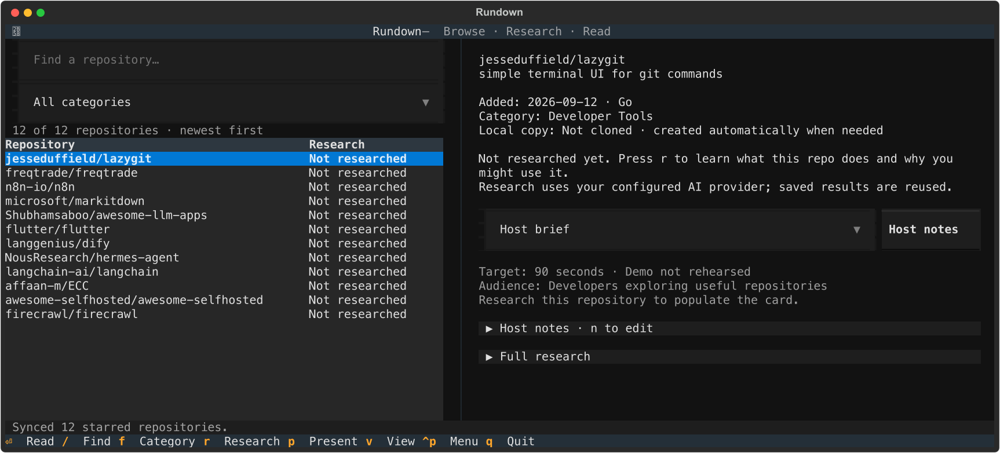
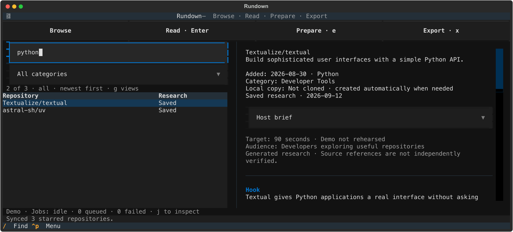
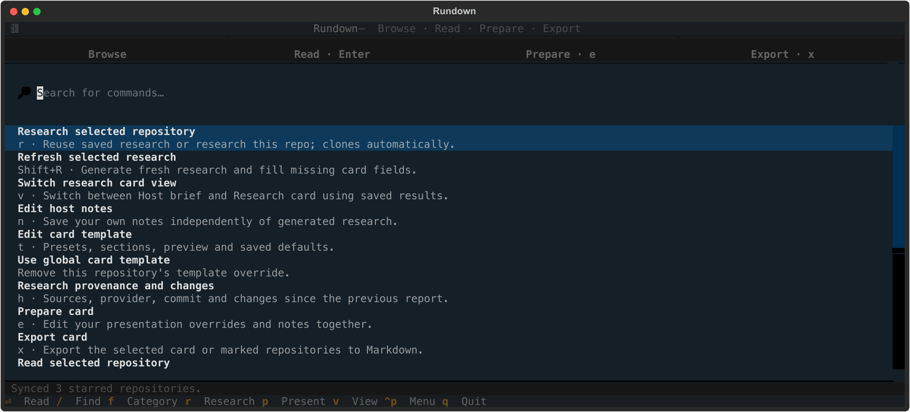
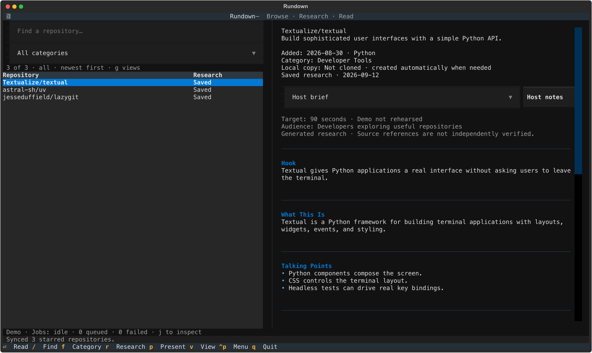
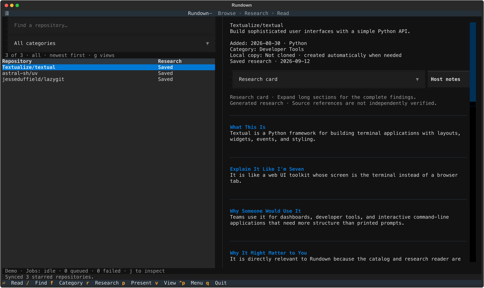

# Rundown

[](https://github.com/EricGrill/rundown/actions/workflows/ci.yml)
[](https://github.com/EricGrill/rundown/releases/latest)
[](LICENSE)

**You've starred hundreds of GitHub repos—and forgotten why you saved most of them.**

Rundown turns that star graveyard into a research library. Sync your stars, auto-categorize them, and generate research summaries with Claude, Gemini, or Codex CLIs. Browse everything in a keyboard-driven TUI, mark repos for presentation, and export host briefs to Markdown.

All local-first: SQLite storage, no API keys stored, no telemetry. Try it offline with `rd demo`.

<!-- 
🎬 HERO GIF PLACEHOLDER

TODO: Add 20-30s animated demo here (see issue #31)
Recording instructions: https://github.com/EricGrill/rundown/issues/31

Suggested path: docs/images/tui-hero.gif
Suggested flow: rd demo → filter → open host brief → switch views

Until recorded, the static screenshots below demonstrate the TUI.
-->

## Features

- **Sync stars** from GitHub using the `gh` CLI
- **Auto-categorize** into AI & Agents, Developer Tools, Infrastructure & Security, Knowledge & Learning, or Apps & Business
- **AI research** via Claude Code, Gemini CLI, or Codex CLI—your choice
- **Browse and filter** in a keyboard-driven TUI
- **Export** repositories marked for presentation to Markdown
- **Local-first**: all data stays on your machine

## TUI preview

Captured from the running TUI with a sample catalog of public repositories.

Browse repositories and read their details side by side:



Press `/` to filter repositories by name or description:



Press `Ctrl+P` to open the searchable action menu:



## Requirements

- Python 3.11 or newer
- Git
- [GitHub CLI](https://cli.github.com/) authenticated with `gh auth login`
- At least one supported AI CLI, authenticated before research:
  - Claude Code: `claude auth login`
  - Gemini CLI: run `gemini` and complete its sign-in flow
  - Codex CLI: `codex login`

## Install

Install Rundown as an isolated command-line tool:

```bash
uv tool install git+https://github.com/EricGrill/rundown.git
```

Or with pipx:

```bash
pipx install git+https://github.com/EricGrill/rundown.git
```

The CLI is available as `rundown` and its short alias `rd`. Check your setup and explore the bundled demo:

```bash
rd doctor
rd demo
```

See the [install and upgrade guide](docs/install.md) for upgrades, version releases, and development setup.

## Try it offline

`rd demo` opens bundled sample research in a temporary, isolated catalog. No GitHub login, AI provider, network access, or personal catalog is needed. Demo changes disappear on exit.

## Quick start

```bash
# Sync your GitHub stars
rd sync-stars

# Browse in the TUI
rd tui

# Research a specific repository (optional)
rd research OWNER/REPO

# Mark repositories for presentation
rd mark astral-sh/uv present
rd mark pydantic/pydantic shortlist

# Export presentation-ready Markdown
rd export
```

## TUI keys

| Key | Action |
| --- | --- |
| `↑` / `↓` | Select a repository |
| `Enter` | Read its details and saved research |
| `r` | Research it; cloning happens automatically when needed |
| `Shift+R` | Refresh research, bypassing the saved result |
| `v` | Switch between Host brief and Research card |
| `p` | Toggle whether this repository is marked for presentation |
| `n` | Edit host notes; `Ctrl+S` saves and `Esc` cancels |
| `t` | Edit card templates and preview saved research |
| `g` | Research filters, sorting, and named catalog views |
| `j` | Research jobs, cancellation, and retry |
| `h` | Research provenance and changes |
| `/` | Search names and descriptions |
| `f` | Filter by category |
| `Ctrl+P` | Open the full action menu |
| `Esc` | Return to the list or clear filters |
| `q` | Quit |

The five categories are **AI & Agents**, **Developer Tools**, **Infrastructure & Security**, **Knowledge & Learning**, and **Apps & Business**.

## Research cards

Choose **Host brief** for a short show segment or **Research card** for deeper evaluation. Press `v` or use the view selector. The chosen view is remembered for each repository, and switching uses saved research without calling an AI provider.

Sections have distinct headings, Markdown bullets, and short previews. Expand **Read full section** for a long finding, or **Full research** to see the complete original report. Use `Tab` to reach disclosure controls and `Enter` to toggle them. Older Markdown reports remain readable; unavailable fields show **Unknown**. `Shift+R` generates a fresh report when you want new show details.

The screenshots below show the running TUI with illustrative research from the offline demo:





**Host notes are yours.** Press `n` to edit them, `Ctrl+S` to save, or `Esc` to cancel. Notes are stored separately from generated research and survive syncs, view changes, and research refreshes. Demo ideas are labeled **not rehearsed**; generated source references are not independent verification.

Press `t` to choose **60-second discovery**, **Technical deep dive**, or **Live demo**. Edit audience, tone, target duration, section visibility/order, and preview length while previewing saved research. `Ctrl+S` saves; `Esc` cancels. Save globally or for the selected repository. Repository templates override saved global settings, which override TOML defaults. **Use global card template** in the action menu removes a repository override.

You can also configure defaults in `config/rundown.local.toml`:

```toml
[cards]
default_view = "host" # host or research
audience = "Developers exploring useful repositories"
tone = "Plain, concise, conversational"
duration_seconds = 90 # target, not measured runtime

[cards.host]
sections = ["hook", "what_it_is", "talking_points", "demo", "risks", "recommendation", "sources"]
word_limit = 60 # per-section preview; full text remains available

[cards.research]
sections = ["what_it_is", "use_cases", "how_it_works", "strengths", "risks", "setup", "questions", "recommendation", "sources"]
word_limit = 120
```

Start with `rd tui --config config/rundown.local.toml`. Section lists set both visibility and order. Changing view, section order, or preview length only changes presentation. Audience, tone, and duration affect future generated content; use `Shift+R` to refresh an existing report with those settings. Per-repository view choices override `default_view`.

Available sections: `what_it_is`, `analogy`, `use_cases`, `personal_fit`, `interest`, `how_it_works`, `practical_uses`, `strengths`, `risks`, `setup`, `maturity`, `questions`, `recommendation`, `hook`, `why_now`, `talking_points`, `demo`, and `sources`. Lists must be nonempty, contain unique known IDs, and use preview limits of 10–1,000 words. Segment targets range from 15 to 3,600 seconds.

New research is validated as a versioned record of named fields and also exported as Markdown. Existing research history is retained. Card preferences and host notes live in the same local SQLite catalog; host notes are not sent to the research provider.

## Catalog views and research jobs

Press `g` to combine search/category with researched, unresearched, stale, shortlisted, or presentation-ready filters. Sort by starred date, relevance, stars, or research date. Stale means the saved research exceeds the configured age, has no usable timestamp, or predates repository changes; repositories without research use the separate unresearched filter. Name a view and press `Ctrl+S` to save it, or `Ctrl+Enter` to apply without saving. `Esc` cancels the editor. In the catalog, `Esc` clears filters; returning from the reader preserves them.

Press `j` to inspect queued, cloning, researching, completed, failed, cancelling, and cancelled jobs with elapsed time. Select a job and press `c` to cancel or `r` to retry a failed/cancelled job. Active cancellation terminates the current subprocess before the next job starts; prior research and notes remain. Closing Rundown cancels its jobs. Job history lasts for the current session.

## Research provenance and changes

Press `h` to inspect the latest two successful reports, their provenance, and section-level before/after differences:

```bash
rd research-history OWNER/REPO
rd research-history OWNER/REPO --json
```

New reports record the actual provider, source commit and dirty state captured before generation, context file hashes, timestamp, prompt version, and schema version. Older reports show unavailable provenance as unknown. This describes the context provided to the model; generated citations are not independently verified evidence.

## Research repositories

Preview the repositories that do not have saved research:

```bash
rd research-missing --dry-run
```

Research a bounded batch, newest star first:

```bash
rd research-missing --limit 10
```

The command shows overall progress, the current clone or research stage, elapsed time, and saved/failed counts. `Ctrl+C` stops the batch while keeping completed results.

Configure the provider in `config/rundown.toml`:

```toml
[research]
# auto tries Claude, then Gemini, then Codex
provider = "auto"
profile = "Describe the projects, languages, and constraints relevant to you."
```

Valid providers are `auto`, `claude`, `gemini`, and `codex`. Rundown does not override a model, so each CLI uses its configured default.

## Export for presentation

Mark repositories you want to present:

```bash
rd mark astral-sh/uv present
rd mark pydantic/pydantic shortlist
```

Add optional human-authored presentation fields. Exports use your effective card template and saved view, apply these overrides, and include host notes:

```bash
rd card astral-sh/uv \
  --hook "10x faster than pip" \
  --who-for "Python developers" \
  --problem "Slow package installs" \
  --why-now "Growing dependency trees"
```

Generate presentation-ready Markdown:

```bash
rd export                          # Exports present + shortlist repos
rd export --decision present       # Only present
rd export --output slides.md       # Custom output path
rd export --view host              # Override saved views with Host brief
rd export --view research          # Export Research cards
```

Manual fields omitted by the template remain under **Presentation Details**. Long sections include expandable full text, and legacy Markdown reports remain available in full.

## Check your setup

```bash
rd doctor
rd doctor --json
```

Diagnostics check Python, Git, GitHub CLI/authentication, provider commands, configuration, and existing SQLite integrity without generating research or creating a catalog. Provider authentication is not probed; missing optional tools appear as warnings so offline browsing remains usable.

## Privacy and security

Rundown is designed for local-first privacy:

- **No API keys stored**: Rundown never reads or stores AI API keys. Authentication is delegated entirely to `gh auth login` and your AI CLI (`claude`, `gemini`, or `codex`).
- **No telemetry**: Rundown does not collect usage data or phone home.
- **Local configuration**: Copy `config/rundown.toml` to `config/rundown.local.toml` for personal settings—it's gitignored.
- **All data stays local**: The SQLite catalog, cloned repos, wiki pages, and logs are stored in local directories that are gitignored.

### What Rundown touches

| Resource | How used | Leaves your machine? |
| --- | --- | --- |
| Local disk (`data/`, `repos/`, `wiki/`, `logs/`, `exports/`) | SQLite catalog, cloned repos, research, logs | No (gitignored) |
| `gh` CLI | Star sync via `gh api` | GitHub API only |
| AI CLI (`claude`, `gemini`, `codex`) | Research generation from repo excerpts | AI provider only |
| Network | Cloning repos, GitHub API, AI provider calls | Only during sync/research |

**Offline guarantees**: `rd demo` uses bundled fixtures and never touches network, GitHub, AI providers, or your catalog.

**Trusted local tools**: Rundown shells out to `git`, `gh`, and your configured AI CLI. It does not execute repository code unless you explicitly run `rd run --execute --allow-non-docker`. Subprocess output is captured for research; Rundown does not inject credentials or override model configuration.

Research sends repository metadata and content excerpts to your configured AI CLI. Review the provider's data policy before researching private repositories.

See [SECURITY.md](SECURITY.md) for vulnerability reporting.

## Other CLI commands

Run `rd --help` for the full command list. Common commands include:

```bash
rd sync-stars          # Sync stars from GitHub
rd repos               # List all repositories
rd research OWNER/REPO # Research a single repository
rd classify            # Reclassify all repositories
rd update-repos        # Update local clones
rd mark REPO DECISION  # archived, rejected, fork, integrate, present, shortlist
rd card REPO --hook .. # Set presentation card fields
rd export              # Export marked repositories
```

`rd run OWNER/REPOSITORY` only detects and reports a possible startup command. It does not execute repository code unless you add `--execute`. Non-Docker commands also require `--allow-non-docker`.

## Development

For an editable checkout:

```bash
git clone https://github.com/EricGrill/rundown.git
cd rundown
python3 -m venv .venv
source .venv/bin/activate
pip install -e '.[dev]'
```

Run checks from the activated development environment:

```bash
python -m pytest -q
python -m ruff check src tests scripts
python -m pyright --pythonpath .venv/bin/python
python scripts/capture_tui.py
python -m build
python scripts/verify_release.py dist
```

CI checks Linux and macOS on Python 3.11 and 3.14, compares twelve deterministic TUI snapshots, and installs the built wheel in a clean environment. After reviewing an intentional visual change, use `python scripts/capture_tui.py --update-baselines --png` to refresh SVG baselines and README images from the offline fixture.

See [CONTRIBUTING.md](CONTRIBUTING.md) for pull request expectations and the [delivery roadmap](docs/implementation-roadmap.md) for current work. Release instructions are in [docs/install.md](docs/install.md).

## License

MIT License. See [LICENSE](LICENSE) for details.
